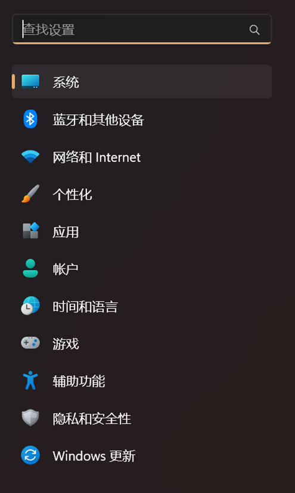

# 爱大VPN使用教程

## 前言

ZJE合作院校爱丁堡大学为每一位学生提供了学校VPN，因为相当于爱丁堡大学校内环境，所以可以实现魔法上网功能，对于生活和学习上均有一些帮助，但是此VPN常常不太稳定，可能会出现连接不上的情况。

## 激活爱丁堡大学VPN账号

### 1. 打开爱大IT Help网站

网址：（[VPN (Virtual Private Network) | The University of Edinburgh](https://www.ed.ac.uk/information-services/computing/desktop-personal/vpn)）

### 2. 点击Registering，再点击Register or reset your password for the VPN service

### 3. 登录爱丁堡大学账户

登录开学时学籍注册所用的爱丁堡大学账户

### 4. 设置VPN密码

### 5. 设置完密码就代表VPN账户已经激活

## 不同平台的VPN连接方式（在此统一优先推荐最后的FortiClient的多平台适用连接方式）

### Windows L2TP

#### 1. 打开设置

#### 2. 网络和Internet

#### 3. 选择VPN

#### 4. 选择添加VPN

#### 5. 按照如下格式填写

连接名称：自定义VPN名称，随意

服务器名称或地址：remote.net.ed.ac.uk

VPN类型：使用预共享密钥的L2TP/IPsec

预共享密钥：Zt6337ZnVLhN

用户名密码留空即可

#### 6. 点击保存，VPN列表中会出现VPN信息

#### 7. 点击连接，第一次使用会让你输入账户密码

账号为s开头的用户名

密码为刚才激活账号步骤中设立的密码

#### 8. 连接成功以后可以在任务栏右侧快速连接VPN（点击电池图标）

点击右上角VPN，可以看到VPN配置

### MacOS L2TP

#### 1. 打开系统偏好设置-网络-右下角-添加VPN-L2TP/IPsec

#### 2. 按照如下格式填写

（显示名称随意，账户为s开头学号，密码为刚才设置的）

共享密钥为Zt6337ZnVLhN

#### 3. 点击选项把通过VPN连接发送所有流量打开

#### 4. 点击“好”，即可在系统偏好设置左侧菜单中选择VPN选项卡连接VPN

### FortiClient 连接方式

#### 1. 打开爱大官方FortiClient VPN客户端下载网站

网址：（https://information-services.ed.ac.uk/computing/desktop-personal/vpn/forticlient-vpn）

#### 2.根据自己的需要下载对应平台的VPN客户端

 （会需要登录爱大的账号才能访问相应的教程页面，如果需要下载对应的客户端可以直接使用后文的链接）

这里贴出直接下载的链接：

Windows：https://links.fortinet.com/forticlient/win/vpnagent

MacOS：https://links.fortinet.com/forticlient/mac/vpnagent

（没有涉及到的平台可以自行访问爱大官网的教程进行下载）

#### 3. 安装对应的客户端，笔者这里以Windows客户端为例

Windows用户直接双击下载的.exe文件进行安装。

#### 4. VPN配置环节

打开安装好的FortiClient客户端，点击配置连接（如下图）。选择SSL-VPN选项，连接名称自定义一个喜欢的，不要有特殊字符，建议是英文字母的组合，远程网关填写`remote.net.ed.ac.uk`，勾选自定义端口，并且填写上`8443`，勾选保存登录名，用户名为s开头的学号，选择保存。

#### 5. 连接

此时回到首页输入密码即可连接爱大VPN，这种方式的稳定性会比之前介绍的连接方式更加稳定可用性更高一些，故比较推荐。

