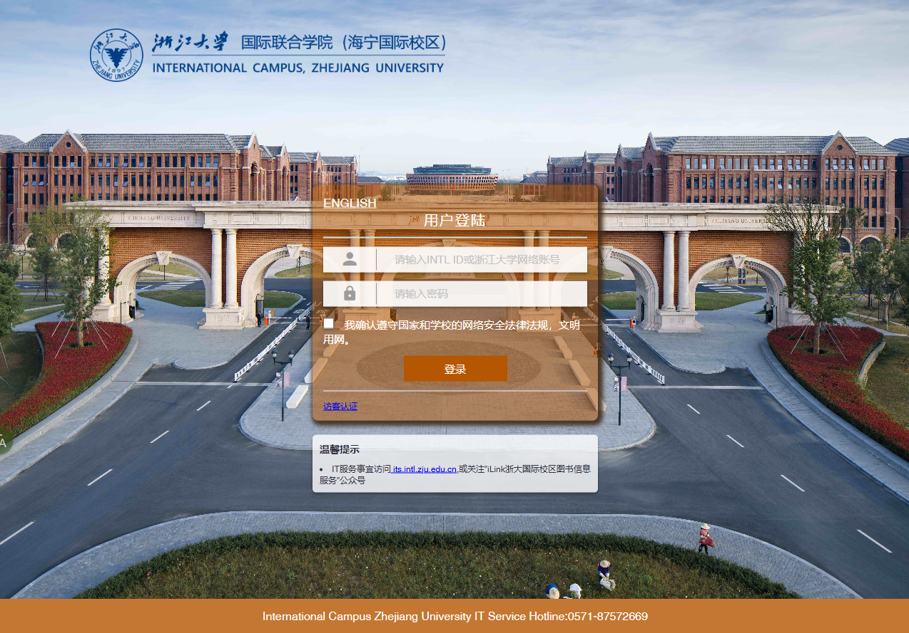

# 校区网络使用指南

## 前言

浙江大学国际校区为学生提供了有线无线两种连接校园网络的方式，其中，无线网分为ZJUWLAN和eduroam两个不同的网络，本文将会分享如何连接学校的校园网网络。

## 无线网络接入

### ZJUWLAN

ZJUWLAN是浙江大学提供的一项安全的Wi-Fi服务，在浙江大学的各个分校区都可以使用，国际校区也不例外。 当您连接上ZJUWLAN，随意打开一个网页，认证界面便会自动弹出，输入您的身份信息和密码就可以上网了。

### eduroam

eduroam (EDUcation ROAMing) 是专为科研和教育机构开发的安全的环球跨域无线漫游认证服务， 国际校区的学生和教职工可使用国际校区提供的[INTL ID](http://its.intl.zju.edu.cn/zh-hans/node/870468)，在全球已加入eduroam联盟的机构内实现无线网络访问的无障碍漫游。 eduroam信号在国际校区已经全面覆盖，学生和教职工可以使用 [INTL ID](http://its.intl.zju.edu.cn/en/node/869519) 连接eduroam。来自其他eduroam联盟教育机构的访客可以使用其本机构提供的账号连接eduroam。

一般来说，点击eduroam的连接后会自动跳出需要输入账号密码的弹窗，在其中输入你的完整的intl邮箱和自己设置的密码即可上网。

## 有线网络接入

一般来说在书院的房间内都会有网线接口，来同书院的网线接口在房间内AP（看着像路由器的那个）下方（注意要和侧边的接口作区分，侧边的接口不能上网），观通和惟学书院的网线接口在房间内桌子上方AP面板的正面，有一个防尘塞塞住，将塞子拿下即可插网线。

插上网线后连接电脑，随意打开一个网页便会跳出和ZJUWLAN相似的登录认证窗口，在其中输入账号密码后即可上网。

注意：ZJUWLAN的连接和有线网的连接通常有一定的时效性，一段时间后便需要重新认证。
