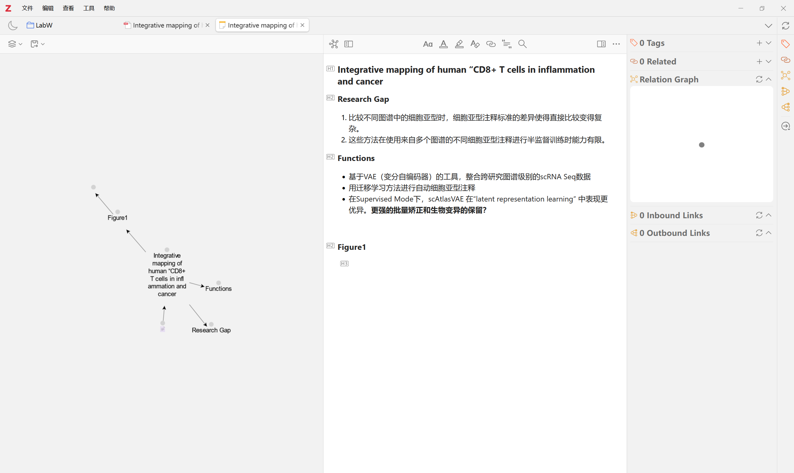

# Zotero使用指南

## 更新日志

- 2025.10.25 写完整个文档的基本内容。

## 前言

Zotero是一个开源的文献管理软件，在论文写作、文献管理等方面有着重要的作用。这篇文章主要包括了Zotero的基本使用，以及一些常用、好用插件的相关介绍和使用教程。

Zotero是一款免费、开源的文献管理软件，它可以帮助您收集、组织、引用和分享研究资源。下面是一份Zotero软件的基本教程，涵盖了从安装到基本使用的步骤。

## 第一部分：安装与设置

### 1. 下载 Zotero

访问 Zotero 官方网站https://www.zotero.org/。下载并安装两个主要组件：

* **Zotero 桌面应用程序 (Zotero Standalone/Desktop Application)**：这是您的文献库管理软件本体。

* **Zotero 连接器（Zotero Connector/Browser Extension）**：这是一个浏览器扩展程序（支持 Chrome, Firefox, Safari 等），用于一键保存网页和文献信息到您的 Zotero 库中。

  下载页面链接：https://www.zotero.org/download/

  

### 2. 安装与初始设置

1.  **安装桌面应用程序**：根据您的操作系统（Windows, macOS, Linux）下载并安装。
2.  **安装浏览器连接器**：根据您使用的浏览器，点击相应的链接进行安装。
3.  **创建 Zotero 账户（可选，但推荐）**：如果您想在不同设备间同步您的文献库，或者使用 Zotero 的在线功能，您需要创建一个免费账户。在 Zotero 桌面应用程序中，进入 **“编辑”** (Edit) 或 **“Zotero”** 菜单 $\rightarrow$ **“偏好设置”** (Preferences) $\rightarrow$ **“同步”** (Sync) 选项卡，输入您的账户信息进行同步设置。但是免费的zotero仓库同步空间有限制，如果有更多文献的同步需求，可以自行配置WebDAV网络储存。

## 第二部分：文献收集与管理

### 3. 收集文献（保存到 Zotero 库）

这是 Zotero 最核心的功能之一。

* **通过浏览器连接器保存**：
    * 当您在学术数据库（如 Google Scholar, Web of Science, CNKI, 数据库官网）或在线期刊网站浏览一篇论文、书籍或网页时，观察浏览器地址栏右侧的 Zotero 连接器图标（通常是一个书本、文件夹或页面图标）。
    
    * **点击该图标**。Zotero 会自动识别页面上的元数据（标题、作者、期刊、DOI等）并将该条目保存到您的 Zotero 库中。

    * 如果页面上有 PDF 文件，Zotero 通常也会尝试一并下载。
    
      
    
* **通过标识符添加（如 DOI, ISBN）**：
    * 在 Zotero 桌面应用程序中，点击工具栏上的 **“魔法棒”图标**。
    
    * 输入文献的 DOI（数字对象标识符）、ISBN（国际标准书号）或其他唯一标识符，Zotero 会自动查找并导入该文献的元数据。
    
      
    
      
    
* **手动添加**：
    * 点击工具栏上的 **“添加条目”图标**（$+$），选择您要添加的文献类型（如“期刊文章”、“书籍”）。
    
    * 输入所有必需的元数据。
    
      
    
* **拖放 PDF 文件**：
    * 直接将本地的 PDF 文件拖放到 Zotero 库的中间窗格中也可以添加条目，Zotero 会尝试从 PDF 中提取元数据。

### 4. 组织和管理文献

* **收藏夹 (Collections)**：
    * 在 Zotero 库左侧窗格中，右键点击 **“我的文库”** (My Library) $\rightarrow$ **“新收藏夹”** (New Collection) 来创建文件夹（项目/主题）。
    * 您可以将文献条目拖放到不同的收藏夹中。**注意：** 一篇文献可以属于多个收藏夹，它仍然只占用一个存储空间。
* **标签 (Tags)**：
    * 选中一个或多个文献条目，在右侧窗格的 **“信息”** (Info) 标签页旁找到 **“标签”** (Tags) 标签页。
    * 您可以手动添加关键词标签，方便日后通过关键词筛选文献。
* **笔记与批注**：
    * 选中一个文献条目，在右侧窗格中选择 **“笔记”** (Notes) 标签页，您可以为该文献添加独立笔记。
    * 如果您在 Zotero 内打开 PDF 并进行高亮或批注，这些内容通常可以自动提取为笔记。

## 第三部分：引用与写作（Word/Google Docs 集成）

### 5. 安装 Zotero 写作插件

在您安装 Zotero 桌面应用程序时，它通常会自动在您的文字处理软件（如 Microsoft Word, Google Docs, LibreOffice）中安装一个**“Zotero”选项卡/工具栏**。如果没有，请检查 Zotero 偏好设置 $\rightarrow$ **“引用”** (Cite) $\rightarrow$ **“文字处理软件”** (Word Processors) 选项卡中是否有相关选项。

### 6. 插入引文与生成参考文献列表

在您使用 Word 或其他兼容软件写作时：

1.  **插入引文（这里使用Harvard Style为例）**：
    
    * 在您希望插入引文的地方，点击 Word/Docs 工具栏上的 **“添加/编辑引文”** (Add/Edit Citation) 按钮。
    
      

    * 首次使用时，Zotero 会要求您**选择引文格式**（如 APA, MLA, GB/T 7714-2015）。
    
      
    
    * 会弹出一个搜索框。在搜索框中输入您要引用的文献的标题、作者或年份，找到该文献并选中。您可以一次性添加多个引文。
    
      
    
    * 点击 **Enter/确认**，引文就会以选定的格式插入到文本中。
    
      
    
      
    
2.  **生成参考文献列表**：
    
    * 当您完成写作，需要在文档末尾生成参考文献列表时，点击 Word/Docs 工具栏上的 **“添加/编辑参考文献”** (Add/Edit Bibliography) 按钮。

    * Zotero 会根据您在文档中插入的所有引文，自动生成一份完整的、格式正确的参考文献列表。
    
      
    
      
    
      
    
      
    
3.  **更改引文样式**：
    * 如果您需要更换引文格式（例如从 APA 换成 GB/T），点击工具栏上的 **“文档偏好设置”** (Document Preferences)，选择新的引文样式，Zotero 会自动更新文档中所有的引文和参考文献列表。
    
      

---

## 第四部分：插件的寻找、安装

### 什么是Zotero插件

Zotero本身提供的功能十分有限，但是Zotero开放了一部分api接口来让社区开发插件来增加Zotero使用体验。

### 如何安装Zotero插件

#### 1. 准备工作：下载插件文件

通常情况下，Zotero 插件是以 **.xpi** 为后缀的文件。您需要从插件的官方网站或GitHub页面下载您想要安装的插件的 **.xpi** 文件，并记住其存放位置。

#### 2. 打开 Zotero 插件管理窗口

在 Zotero 主程序界面中，按照以下步骤打开插件管理窗口：

- 点击 Zotero 菜单栏中的 **“工具”（Tools）**。

- 在下拉菜单中选择 **“插件”（Plugins）**。

- 此时会弹出一个名为“Zotero 附加组件”或“插件”的窗口。

  

  

#### 3. 安装插件

后缀为**.xpi**的文件是Zotero的插件文件格式，有两种常用的方法将下载的 **.xpi** 文件安装到 Zotero 中：

- 方法一：直接拖放

  找到您下载的 .xpi 文件，直接将其拖动到刚才打开的 “Zotero 附加组件”/“插件” 窗口中，Zotero 会自动识别并提示您安装。

- 方法二：通过菜单安装

  在 “Zotero 附加组件”/“插件” 窗口中，

  1. 点击右上角的 **“齿轮”图标**（或可能是一个下拉菜单）。
  2. 选择 **“从文件安装插件...”**（Install Plugin From File...）。
  3. 在弹出的文件浏览器中，选择您下载的 **.xpi** 文件，然后点击 **“打开”**。

  

无论使用哪种方法，Zotero 都会提示您安装插件，确认后，插件即可安装成功。您可能需要重启 Zotero 以使新插件生效。

### 推荐的插件安装方法

Zotero有一个插件叫做**插件市场**，通过上述方法安装好**插件市场**插件以后即可可视化的安装更新插件。

链接：https://github.com/syt2/zotero-addons

选中一个插件以后右键即可看到安装选项

### 如何在互联网寻找Zotero插件

- 直接通过搜索引擎（Google，Bing，百度（不推荐，广告太多））

- GitHub，大多数插件在GitHub上都找得到

- 推荐：Zotero中文社区的插件栏目https://zotero-chinese.com/plugins/

  

- 推荐：各种Zotero插件测评推荐博客文章（比如本文）

## 第五部分：插件推荐以及基础使用方法

### Translate for Zotero（推荐）

#### 简介

链接：https://github.com/windingwind/zotero-pdf-translate

Zotero PDF Translate是由@windingwind 开发的，用于文献管理软件Zotero的翻译插件。它完全开源、免费，主要功能有：

- 划词翻译（自动/手动）
- 标题、摘要翻译与源文本/翻译结果显示切换
- 批注翻译（自动/手动）
- 支持15+种翻译服务与4+种字典服务
- 自定义翻译侧栏UI，支持同时使用多种翻译引擎

使用文档：https://zotero.yuque.com/staff-gkhviy/pdf-trans

#### 插件效果

在Zotero默认的PDF查看器中打开文档，可以划词翻译（更常用），或是在右侧侧边栏中有单独的翻译窗口。

#### 基本使用

这个翻译插件默认情况下谷歌翻译是可用的，其他翻译提供商如（有道、ChatGPT）可能需要配置密钥和api，详见上述的使用文档，笔者比较常用ChatGPT作为翻译供应商。关于如何配置翻译供应商，笔者在这里引用自用的转发api的官方文档来解释https://chatanywhere.apifox.cn/#zoter%E4%B8%AD%E7%9A%84%E7%BF%BB%E8%AF%91。

### Better Notes for Zotero（推荐）

#### 简介

“Zotero Better Notes” 插件（GitHub 仓库名为 [`windingwind/zotero-better-notes`](https://github.com/windingwind/zotero-better-notes)是一个功能强大的 Zotero 附加组件，它旨在全面增强和简化 Zotero 中的笔记管理工作流程。主要功能包括：

- **一体化工作流增强：** 旨在将**文献阅读**、**标注（Annotating）**、**笔记记录（Note Taking）**、**元数据分析**、**知识导出**和**AI 写作辅助**等所有流程整合到 Zotero 内部。
- **知识关联与管理：**
  - **笔记链接（Note Link）：** 支持通过简单的操作将不同的知识片段与笔记链接起来，实现知识互联。
  - **上下文面板：** 在笔记编辑器中提供标签、相关项目、关系图和入/出站链接等信息。
- **高级编辑体验：**
  - **增强型编辑器：** 改进了 Zotero 自带的笔记编辑器，支持**无限数量**的笔记标签页/窗口，提供**大纲（Outline）**功能，并支持查看**图片**等。
  - **Magic Key 命令面板：** 通过输入 `/` 或按下 `Ctrl/Cmd + /` 唤出命令面板，快速执行操作。
  - **Markdown 支持：** 支持直接粘贴 Markdown 内容到编辑器中，并自动转换为富文本格式。
- **同步与导出：**
  - **Markdown 双向同步：** 可以自动将 Zotero 笔记与外部 Markdown 文件（如 Obsidian 笔记）进行双向同步，无需第三方工具。
  - **灵活导出：** 支持将笔记导出为多种格式，包括：新的 Zotero 笔记、Markdown 文件（嵌入或链接图片）、**MS Word 文档 (.docx)**、**PDF 文档 (.pdf)** 和 **FreeMind 文件 (.mm)**。
- **自动化与模板：**
  - **笔记模板（Note Template）：** 提供强大的笔记模板功能，用于快速总结元数据和标注、比较文献、或以编程方式生成内容，实现笔记自动化。
  - **工作流自动化：** 结合其他插件，可用于实现如打开项目时自动生成笔记等自动化操作。
- **GPT 集成（需搭配 Zotero-GPT 插件）：** 如果安装了相关插件，可以在笔记编辑器中唤醒聊天面板，实现内容的插入和修改。

#### 插件效果

#### 基本使用

Quick Start: https://github.com/windingwind/zotero-better-notes?tab=readme-ov-file#-quick-start

选中一篇文献右键可以添加笔记，然后会跳转到相应的笔记页面。其中笔记的页面左侧是思维导图、泡泡图等，可以看到笔记的结构和思路，中间是主笔记区域，支持Markdown语法，右侧是链接标签相关侧边栏。由于篇幅关系就暂时先介绍到这里，具体更加具体和高级的使用方法可以自行阅读文档。

### Awesome GPT （推荐）

#### 简介

链接：https://github.com/MuiseDestiny/zotero-gpt

不用多说，看名字就知道这个插件好用的离谱。主要是把各种AI模型问答集成到Zotero中，让Zotero集成各种AI功能。此插件可以花钱解锁专业版，可以有一些额外的功能。比如：通过浏览器插件调用网页版AI如GPT网页版和Gemini网页版，AI侧边栏等等。

这是Polygon插件三件套之一（Zotero Style Pro， Zotero Reference Pro，Zotero GPT Pro（Awesome GPT））

使用文档：https://x9l8rgumba.feishu.cn/docx/P9STduZyvoWtWnxkfPWcdtSKnje

#### 插件效果

#### 基本使用

> **背景补充：什么是AI模型的API：**
>
> AI 模型的 API 就像一个**可以远程使用的智能“大脑”服务窗口**。你通过互联网向这个窗口（API）提交一个任务或数据（比如一段文字或一张图片），然后这个“大脑”（AI 模型）就会处理它，并把**结果**（比如一段回复、一个翻译或对图片的识别）通过窗口回传给你。这样，你的软件或应用就能轻松拥有人工智能的能力，而不需要自己去搭建和维护复杂的 AI 系统。

##### API配置方法

主要是介绍一下API的配置方法（这里以笔者自用的ChatAnywhere API为例）：

ChatAnywhere官方文档：https://chatanywhere.apifox.cn/#zotero

这里主要是注意几个地方：

- 第一项：API网址（https://开头这个链接，这个根据不同的API供应商而不同，右侧可以选择常用供应商）这个决定了你的AI请求会发到哪里去，笔者这里选择ChatAnywhere。
- 第二项：API Key，这里填写你的API密钥（千万不能泄露，这个关系到你的API余额的安全，每一次调用API都会消耗API的余额），API密钥的购买方法有很多，供应商也有很多，ChatAnywhere提供一个免费的但是有使用限制的API供大家使用，具体可以查看ChatAnywhere的GitHub页面（https://github.com/chatanywhere/GPT_API_free），如果想要不受限制模型更多的API，可自行购买付费API（本文章以及笔者和ChatAnywhere没有利益来往，本文章不构成任何API的购买建议）。
- 第三项：模型选择，通常一个模型会有一个唯一标识符，比如GPT 4O Mini的为gpt-4o-mini，这个可以在模型API提供商处查看（如下图），比如https://chatanywhere.apifox.cn/doc-2694962
- 第四项：Using custom embeddings，通常如果使用GPT则不用管，但是如果使用Kimi等没有embedding的模型的时候需要指定Embedding Model（关于Embedding和Embedding Model是什么，请自行AI或者Google）
- 其余的选项建议直接保留默认即可，配置完后可以点击Test查看配置是否正确。

配置完后应该就可以顺利使用上gpt。

### Ethereal Style（推荐）

#### 简介

链接：https://github.com/MuiseDestiny/zotero-style

这个插件主要是一个Zotero美化插件，并且通过美化以后可以一定程度上提高文献阅读和调研的效率，如显示期刊影响因子分区，阅读进度条，标签。但是本插件的目标人群是想美化自己的Zotero，并且有一定学习插件的实践，本插件确实有能一定程度上提高效率的功能，但是不可避免地会对性能有影响，这个可以自己权衡。

具体的使用文档见此：https://www.notion.so/Zotero-Style-bc2aebbbb6df4b7baa858e376e4fc5be

同样的这个插件也属于Polygon插件三件套之一（Zotero Style Pro， Zotero Reference Pro，Zotero GPT Pro（Awesome GPT））有基础的免费功能，但是也可以付费解锁Pro功能。

#### 插件效果

显示期刊标签、阅读进度，Emoji评分

显示文献之间的关联

显示彩色的Tag标签

切换PDF阅读主题

其他功能详见官方文档

#### 基本使用

本插件的核心功能基本之一是可以管理标签栏显示什么信息，比如期刊标签和影响因子在大规模文献调研的时候可以方便的知道期刊水平等信息。

添加彩色Tag的步骤如下图，首先Tag必须是/开头的特殊Tag，才能在左下角上右键Tag分配颜色。

切换PDF的阅读主题可以看插件效果图中注明的位置（虽然感觉还是喜欢阅读白色底的）。

### DOI Manager

#### 简介：

这个插件可以便捷的获取文献的DOI Number，从而更方便Zotero刮削元数据。

链接：https://github.com/bwiernik/zotero-shortdoi

#### 基本使用：

右键一篇文献，点击Manage DOI，选择对应的选项（有几率失败，比较玄学，大部分时候都可以用）

### Green Frog （比较推荐）

#### 简介：

根据EasyScholar来更新期刊等信息。

链接：https://github.com/redleafnew/zotero-updateifsE

#### 主要功能（Copy自GitHub）：

1. 更新期刊信息。

   - 点击分类及条目右键菜单中的`从easyScholar更新期刊信息`或使用快捷键（默认为`Ctrl+J`，可在设置中修改或停用快捷键）后，Green Frog插件根据条目语言从[easyScholar](https://easyscholar.cc/)获取期刊信息等，具体包括：
     - 获取期刊或会议论文（需要将会议名称填入`Conference Name`字段）的`JCR分区`、`中科院分区基础版`、`中科院分区升级版`、`影响因子`和`5年影响因子`、`EI`、`中科院升级版Top分区`、`中科院升级版小类分区`、`中科院预警`等信息。
     - 获取中文期刊是否`EI`、`CSCD收录`、`北大/南大核心`、`科技核心`、`SSCI`、`AJG`、`UTD24`、`FT50`、`CCF`、`FMS`、`JCI`、`AHCI`、`ESI`、`复合影响因子`，`综合影响因子`，以及`南农大核心期刊`、`南农大高质量期刊`、各个大学对期刊的分类信息。
     - 基于[easyScholar](https://easyscholar.cc/)自定义数据集（详见[easyScholar](https://easyscholar.cc/)获取期刊信息）。
       - 如果要使用自定义数据集，需要在[easyScholar](https://easyscholar.cc/)网站中登录，添加并在easyScholar浏览器插件中选中需要的自定义数据集。
   - 期刊信息保存在`我的文库`窗口右侧`信息`面板的`“其他”`字段中，如果显示不正常请先清空`“其他”`字段（点击`工具`-`清空“其他”字段...`即可）。
   - 可在`编辑`-`设置`-`绿青蛙`中设置哪些字段在列中显示（默认全部显示，如果不需要可以自行关闭），然后在列上右击并勾选即可显示相应字段。

   

   - 在`编辑`-`设置`-`绿青蛙`中设置要获取的期刊信息内容和显示的工具箱菜单：

   

   - 在列上右键设置显示的内容：

   

2. 更新条目元数据。

3. 清空`“其他”`字段内容（`工具`-`清空“其他”字段...`）。

4. 给作者加粗、加星、清除加粗、清除加星；作者姓名改为词首字母大写；交换作者姓和名；将文献题目改为首字母大写；文献题目查找替换；更改期刊名称大小写；更改期刊名称；显示Zotero配置目录，显示Zotero数据目录等小工具（`工具`-`工具箱`）。

   - 在`工具`-`工具箱`显示：

   

5. 更新期刊缩写，带点或不带点。目前期刊缩写数据库只有5000多条数据，可以设置如果英语或中文条目期刊缩写查询不到时是否用全称代替（会根据语言字段进行判断，英语为`en`或`English`，中文为`ch`、`zh`、`中文`或`CN`），语言设置可以使用[Del ltem With Attachment插件](https://github.com/redleafnew/delitemwithatt)）。

6. 可能需要获取easyScholar API，详见设置菜单中此插件配置此处：

   

### SciPDF For Zotero：

#### 简介：

主要是把scihub的功能集成进Zotero，让找文献找到的可能性更大一些。

>**SciHub是什么？**（From Gemini）
>
>**Sci-Hub 是一个著名的“影子图书馆”网站，主要提供学术论文和著作的免费获取服务。**
>
>它通过各种技术手段绕过学术出版商的**付费墙**，使用户可以免费下载数百万篇原本需要付费的科研文献。该网站由哈萨克研究生亚历山德拉·埃尔巴金于 2011 年创立，其目的是打破知识垄断，让全球（特别是资源匮乏地区）的研究人员能够无障碍地获取学术资料。
>
>Sci-Hub 在全球科研界拥有大量用户和支持者，但从法律角度来看，它在许多国家被视为**侵犯知识产权**的非法网站，因此面临着出版商的多次诉讼和法律争议。
>
>（当然笔者可以告诉你，你放心用LoL）

链接：https://github.com/syt2/zotero-scipdf

#### 基本使用：

其实这个插件基本无感使用，如果你的Zotero配置为新项目加入时自动下载PDF，则该插件会自动工作，如果你想手动查找全文，则右键条目选择查找全文即可。

### Linter for Zotero (推荐)

#### 简介：

链接：https://github.com/northword/zotero-format-metadata

主要作用于规范化/格式化条目的元数据

- 提供标题富文本编辑功能（上下标、斜体、粗体等）及对应快捷键
- 导入时检测并提示重复条目
- 校验条目类型是否正确
  - 在抓取失败时发出警告
- 校验并修复条目字段
  - 自动识别和补全条目语言
  - 将标题转换为句子式大写
  - 自动查找并补全期刊缩写
  - 自动查找并补全高校所在地
  - 统一日期、DOI、页码、卷号等字段格式
- 支持基于标识符（DOI、ArXiv ID 等）更新条目元数据

详细说明请参阅 [features](https://github.com/northword/zotero-format-metadata/blob/main/docs/features.md)。

#### 基本使用：

在条目上右键可以看到Linter选项，选择自己需要的选项即可。

